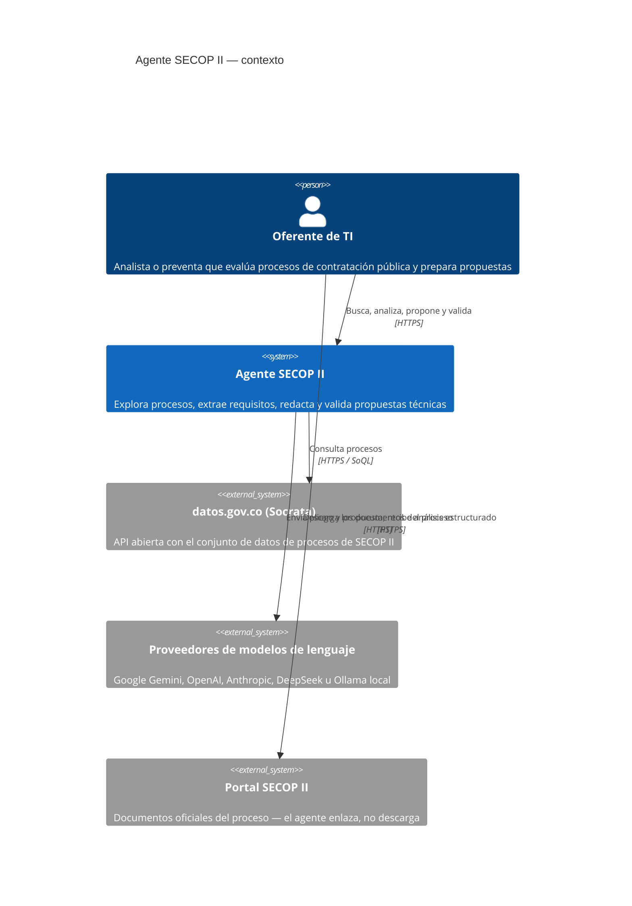
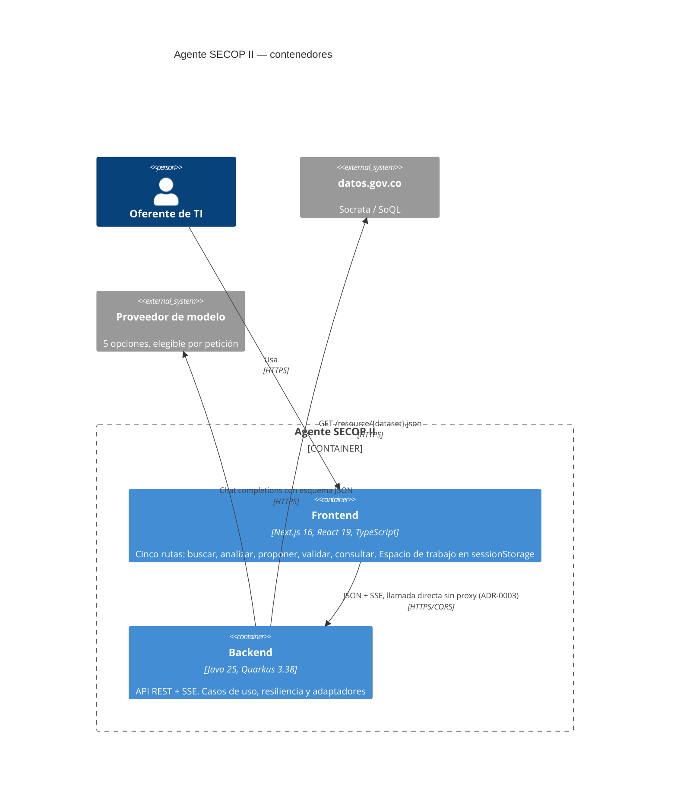
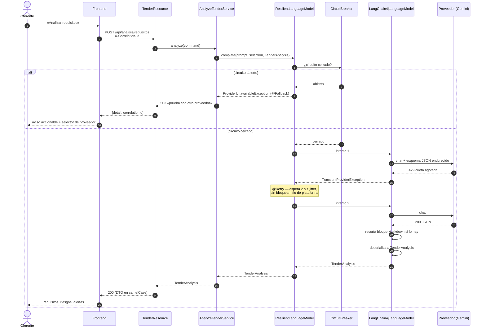
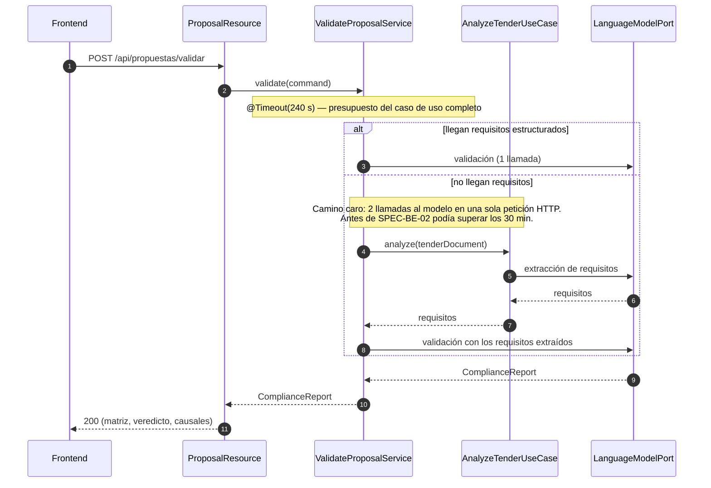
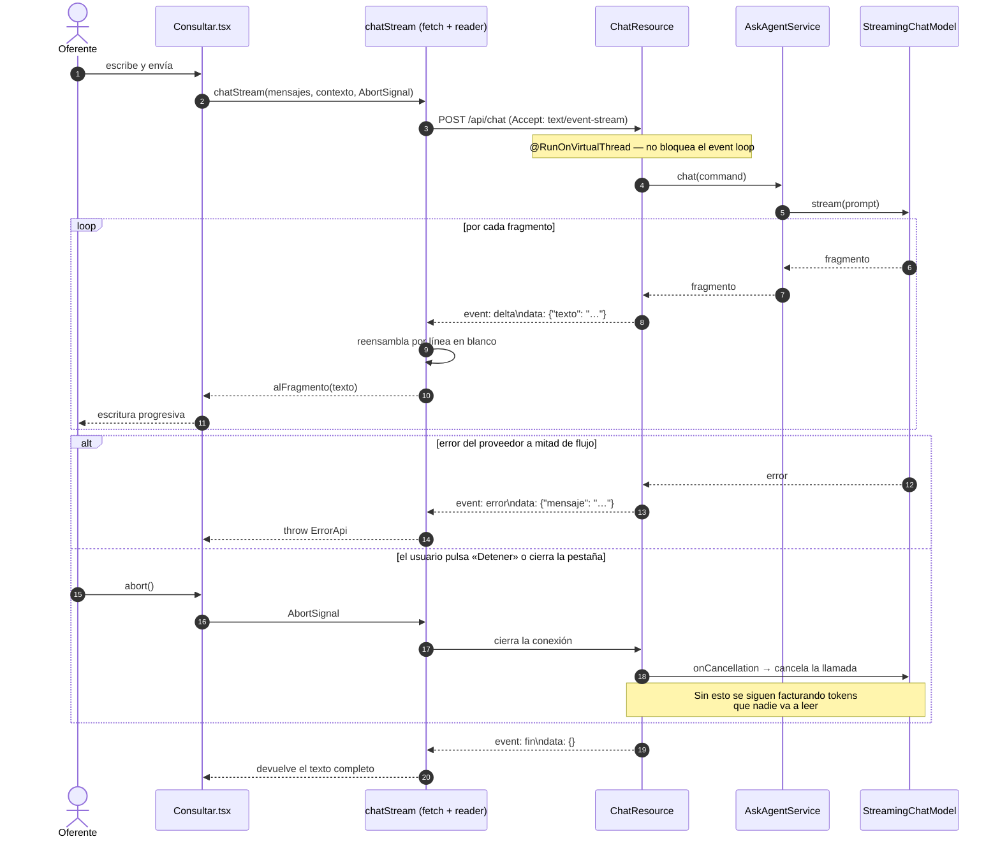
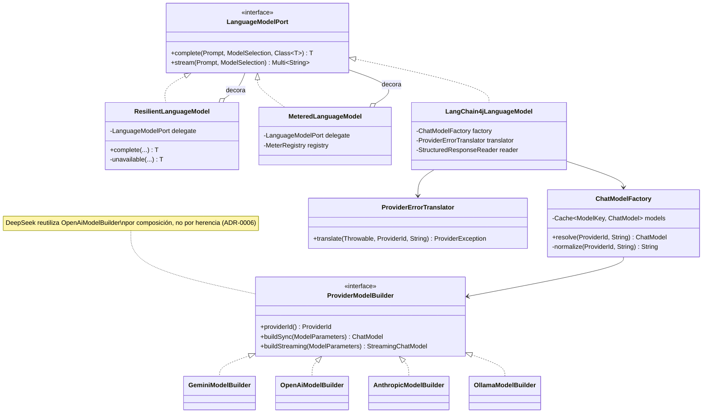
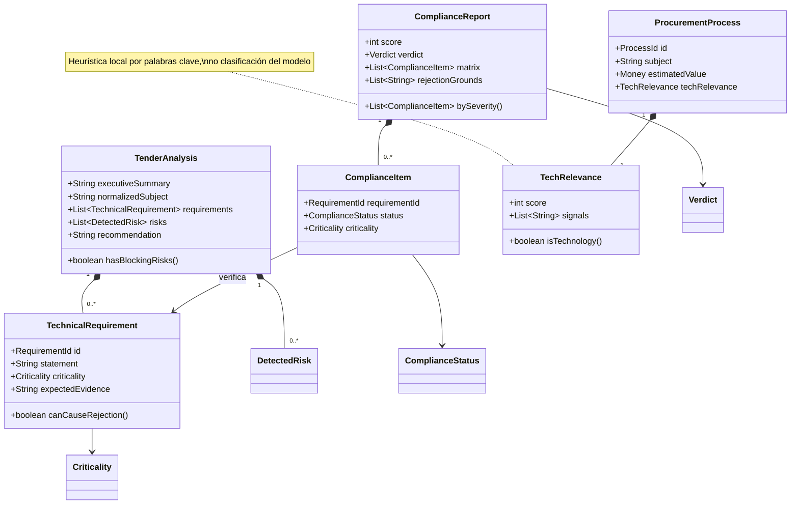
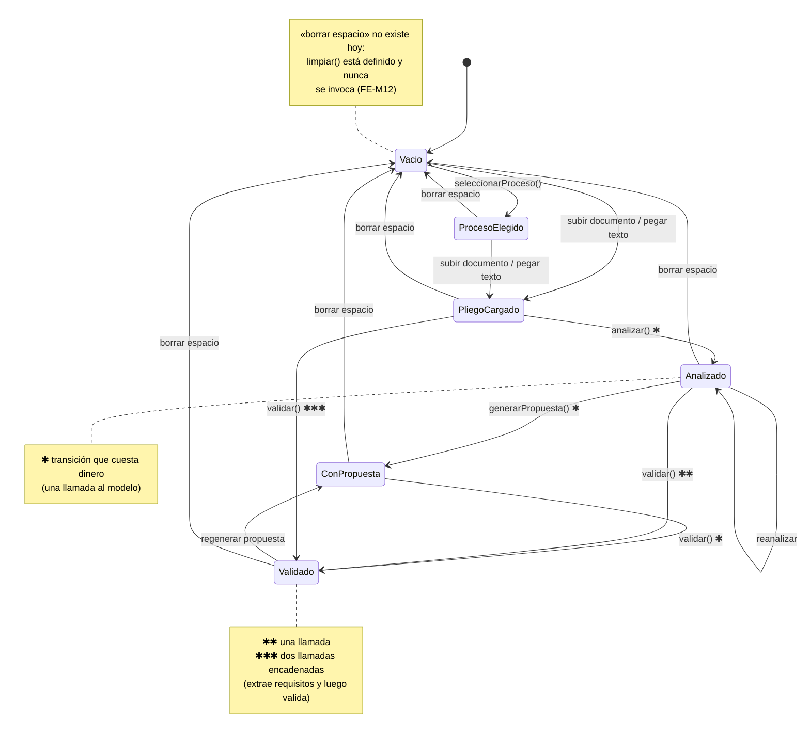
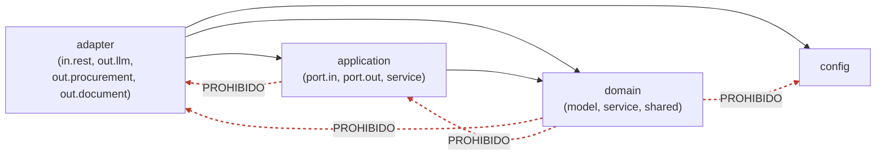

# SPEC-DOC-02 · Diagramas de arquitectura, componentes, secuencia, clases y estados

| | |
|---|---|
| **Estado** | Propuesta |
| **Prioridad** | 🟠 Media |
| **Cierra** | TR-M5 |
| **Depende de** | SPEC-BE-01, SPEC-BE-02 (los diagramas describen la estructura objetivo) |
| **Esfuerzo** | 3–4 jornadas |

---

## 1. Problema

No hay ni un diagrama en el repositorio. La única representación de la arquitectura es el
árbol de directorios del `README.md`, que muestra dónde están los archivos y no cómo
colaboran, ni por dónde entra una petición, ni qué pasa cuando algo falla.

Tres cosas concretas que hoy no se pueden explicar sin leer el código:

- **Que hay dos llamadas al modelo encadenadas** en `validarPropuesta` cuando no llegan
  requisitos estructurados (`BE-A11`). Es un hecho de rendimiento y coste que está enterrado
  en un `if` a mitad de un método de 261 líneas.
- **Qué sucede cuando un proveedor devuelve 429.** El comportamiento —tres intentos, espera
  exponencial, hilo bloqueado— es la característica más importante del sistema en producción
  y no está dibujada en ningún sitio.
- **Que el chat usa un protocolo SSE propio** con eventos `delta`/`error`/`fin` heredado de
  la versión Python, reensamblado a mano en el cliente porque `EventSource` no admite POST.

Un diagrama de secuencia de media página comunica cualquiera de las tres en diez segundos.

El riesgo específico del proyecto: las fases 2 y 3 del plan **cambian esas tres cosas**. Sin
un «antes» dibujado, la revisión de esos cambios se hace comparando código contra memoria.

---

## 2. Decisión

1. **Mermaid en Markdown, versionado junto al código.** No Draw.io, no PlantUML con
   servidor, no imágenes. Un diagrama que no está en el diff de la revisión no se revisa, y
   un `.png` no se revisa.
2. **C4 hasta el nivel 3 (componentes).** El nivel 4 (código) se cubre con dos diagramas de
   clases puntuales, no con uno exhaustivo: un diagrama de clases completo es un `ls` caro
   que envejece en el primer refactor.
3. **Los diagramas de secuencia incluyen los caminos de fallo.** Un diagrama que solo dibuja
   el camino feliz documenta la mitad menos importante.
4. **Validación en CI**: sintaxis de todos los diagramas + coherencia entre el diagrama de
   dependencias y las reglas de ArchUnit.

---

## 3. Diseño

### 3.1 Inventario

```
docs/arquitectura/
├── README.md                      índice y guía de lectura
├── 01-contexto.md                 C4 nivel 1
├── 02-contenedores.md             C4 nivel 2
├── 03-componentes-backend.md      C4 nivel 3
├── 04-componentes-frontend.md     C4 nivel 3
├── 05-secuencia-busqueda.md       incluye degradación de la fuente
├── 06-secuencia-analisis.md       incluye reintentos y cortacircuitos
├── 07-secuencia-validacion.md     las dos llamadas encadenadas
├── 08-secuencia-chat-sse.md       protocolo SSE y cancelación
├── 09-secuencia-carga-documento.md
├── 10-clases-puertos-adaptadores.md
├── 11-clases-dominio.md
├── 12-estados-espacio-trabajo.md  máquina de estados del cliente
├── 13-dependencias-paquetes.md    espejo de las reglas de ArchUnit
└── 14-despliegue.md
```

### 3.2 C4 nivel 1 — contexto



La relación que este diagrama existe para hacer visible es **`agent → llm`**: el texto
íntegro del pliego y de la propuesta comercial sale hacia un tercero. Es el hallazgo `TR-C1`
y es invisible en el código. Dibujarlo es la mitad del trabajo de `SPEC-NT-02`.

La otra observación que salta a la vista: el conjunto de datos abierto **no** contiene los
documentos del proceso, así que el usuario tiene que ir al portal y subirlos a mano. Es una
limitación del producto que hoy solo aparece en un aviso de la interfaz.

### 3.3 C4 nivel 2 — contenedores



La anotación «sin proxy» con referencia al ADR es deliberada: es una decisión contraintuitiva
—lo natural en Next sería un route handler— y sin la nota alguien la «arreglará» y romperá el
streaming.

### 3.4 C4 nivel 3 — componentes del backend (estructura objetivo)

```mermaid
flowchart TB
    subgraph IN["adapter / in / rest"]
        R1[ProcessResource]
        R2[TenderResource]
        R3[ProposalResource]
        R4[ChatResource]
        R5[CatalogResource]
        EM[ExceptionMappers<br/>ProblemDetail + correlationId]
    end

    subgraph APP["application"]
        subgraph PIN["port / in"]
            U1[SearchProcessesUseCase]
            U2[AnalyzeTenderUseCase]
            U3[GenerateProposalUseCase]
            U4[ValidateProposalUseCase]
            U5[AskAgentUseCase]
        end
        subgraph SVC["service"]
            S1[SearchProcessesService]
            S2[AnalyzeTenderService]
            S3[GenerateProposalService]
            S4[ValidateProposalService]
            S5[AskAgentService]
        end
        subgraph POUT["port / out"]
            P1[[ProcurementCatalogPort]]
            P2[[LanguageModelPort]]
            P3[[DocumentTextExtractorPort]]
            P4[[PromptRendererPort]]
        end
    end

    subgraph DOM["domain"]
        D1[model: tender / proposal / procurement]
        D2[service: TechRelevanceScorer]
    end

    subgraph OUT["adapter / out"]
        subgraph LLM["out / llm"]
            A1[ResilientLanguageModel<br/>@Retry @Timeout @CircuitBreaker @Bulkhead]
            A2[MeteredLanguageModel]
            A3[LangChain4jLanguageModel]
            A4[ChatModelFactory<br/>caché acotada]
            A5[ProviderErrorTranslator]
            A6[ProviderModelBuilder ×5]
        end
        subgraph PROC["out / procurement"]
            B1[SocrataProcurementCatalog]
            B2[SoqlQueryBuilder]
            B3[SocrataRowMapper]
            B4[SocrataApiClient]
        end
        subgraph DOC["out / document"]
            C1[CompositeTextExtractor]
            C2[Pdf / Docx / PlainText]
        end
    end

    R1 & R2 & R3 & R4 & R5 --> PIN
    PIN -.implementa.-> SVC
    SVC --> POUT
    SVC --> DOM
    P1 -.implementa.-> B1
    P2 -.implementa.-> A1
    P3 -.implementa.-> C1
    A1 --> A2 --> A3
    A3 --> A4 --> A6
    A3 --> A5
    B1 --> B2 & B3 & B4
    B1 --> D2
    C1 --> C2

    classDef domain fill:#1f6f4a,stroke:#0d3d28,color:#fff
    classDef port fill:#2b5f8a,stroke:#13324a,color:#fff
    class DOM,D1,D2 domain
    class POUT,P1,P2,P3,P4 port
```

La cadena `ResilientLanguageModel → MeteredLanguageModel → LangChain4jLanguageModel` es lo
que este diagrama existe para comunicar: **la resiliencia es una capa, no una
responsabilidad de la implementación**. Nadie deduce eso leyendo cinco clases de proveedor.

### 3.5 Secuencia — análisis con reintento y cortacircuitos

El diagrama más importante del conjunto. Documenta el comportamiento objetivo tras
`SPEC-BE-02`.



### 3.6 Secuencia — validación: las dos llamadas encadenadas



### 3.7 Secuencia — chat SSE, con cancelación



El bloque de cancelación documenta un comportamiento que **hoy no existe** y que
`SPEC-BE-02` §3.4 introduce. Dibujarlo en el «después» es la forma de que la revisión
compruebe que se implementó.

### 3.8 Clases — puertos y adaptadores del modelo de lenguaje



### 3.9 Clases — dominio



Se dibuja **solo el dominio**, no los DTO ni los adaptadores. Un diagrama de clases que
incluye todo es ilegible y envejece en el primer refactor; uno que incluye solo el dominio
cambia cuando cambia el negocio, que es raro y merece revisión.

### 3.10 Estados — espacio de trabajo del cliente



Marcar las transiciones que cuestan dinero es lo que convierte este diagrama en una
herramienta de diseño: se ve de un golpe que `Analizado → Validado` es más barato que
`PliegoCargado → Validado`, que es exactamente lo que la interfaz debería empujar al usuario
a hacer — y hoy solo lo dice en un aviso de texto.

### 3.11 Dependencias entre paquetes



Este diagrama es el **espejo exacto** de `DependencyRuleTest` (`SPEC-BE-01` §3.7). Las
flechas rojas son las cuatro reglas `noClasses()...should()`. La correspondencia es el
mecanismo de §3.12: si alguien añade una regla y no actualiza el diagrama, CI lo detecta.

### 3.12 Validación en CI

Dos comprobaciones, ninguna cosmética:

```yaml
- name: Sintaxis de los diagramas
  run: npx --yes @mermaid-js/mermaid-cli -i docs/arquitectura/*.md --outputFormat svg -o /tmp/out

- name: Diagrama de dependencias coherente con ArchUnit
  run: ./scripts/verificar-diagrama-dependencias.sh
```

El segundo script extrae los paquetes prohibidos del bloque Mermaid de `13-dependencias-paquetes.md`
y los compara con las reglas declaradas en `DependencyRuleTest.java`. Divergencia = fallo.

Es la única forma conocida de que un diagrama de arquitectura no mienta a los seis meses: no
basta con pedir disciplina, hay que hacer que la mentira rompa la compilación.

---

## 4. Plan de ejecución

| Paso | Contenido | Cuándo |
|---|---|---|
| 1 | C4 niveles 1 y 2. No dependen de la refactorización. | Ya |
| 2 | Secuencias del **estado actual** de búsqueda, análisis y chat. | **Antes de la fase 2** |
| 3 | C4 nivel 3 y clases de la estructura objetivo. | Con la fase 2 |
| 4 | Actualizar las secuencias al comportamiento nuevo (reintentos, cortacircuitos, cancelación). | Con la fase 3 |
| 5 | Estados del espacio de trabajo. | Con la fase 4 |
| 6 | Diagrama de dependencias + script de coherencia. | Con la fase 2 |
| 7 | Despliegue. | Con `SPEC-NT-03` |

El paso 2 va **antes** de la fase 2 a propósito, y es el único con urgencia: son los
diagramas del «antes». Después de refactorizar, dibujar cómo era el sistema requiere
arqueología en el historial de git.

---

## 5. Criterios de aceptación

1. Los 14 diagramas existen y renderizan sin error con `mermaid-cli` en CI.
2. Cada diagrama de secuencia incluye al menos un camino de fallo, no solo el feliz.
3. El diagrama de contexto muestra explícitamente que el pliego y la propuesta salen hacia
   un proveedor externo.
4. El diagrama de dependencias declara las mismas prohibiciones que `DependencyRuleTest`, y
   el script de coherencia falla si divergen.
5. Existen las versiones «antes» de las tres secuencias principales, fechadas, para poder
   comparar en la revisión de las fases 2 y 3.
6. Ningún diagrama contiene claves, URL internas ni datos reales de un proceso.
7. `docs/arquitectura/README.md` dice qué diagrama leer según la pregunta que se tenga.
8. Ningún diagrama se genera a partir del código: se escriben a mano y se validan. Un
   diagrama autogenerado del código es el código otra vez.

---

## 6. Riesgos

| Riesgo | Mitigación |
|---|---|
| Los diagramas envejecen y mienten. | El de dependencias se verifica en CI. Los de secuencia se revisan en la definición de terminado de cualquier cambio que toque un flujo (`SPEC-DOC-01` §guía de contribución). |
| Catorce diagramas son demasiados para mantener. | Diez de los catorce cambian solo si cambia la arquitectura. Los que cambian a menudo son los de secuencia, que son también los más valiosos. Si alguno resulta no consultarse nunca, se borra: un diagrama muerto es peor que ninguno. |
| Mermaid se queda corto para el C4. | Mermaid tiene soporte nativo de C4 en los niveles 1 y 2; el nivel 3 se dibuja con `flowchart`, que es suficiente y más legible. Si algún día no basta, la salida es Structurizr, no imágenes. |
| Se dibuja la arquitectura objetivo y se confunde con la actual. | Cada archivo lleva en la cabecera `Estado: actual | objetivo` y la fecha. Los del paso 2 se marcan `actual (previo a la fase 2)` y se conservan. |

---

## 7. Fuera de alcance

- Diagramas de entidad-relación: no hay base de datos y no se propone añadir ninguna.
- Diagramas de despliegue en la nube con proveedor concreto: hasta que `SPEC-NT-03` no
  decida dónde se despliega, sería ficción.
- Diagramas de los módulos retirados `backend/` y `frontend/`.
- Modelado UML exhaustivo. Se dibuja lo que responde una pregunta que alguien se hace.
