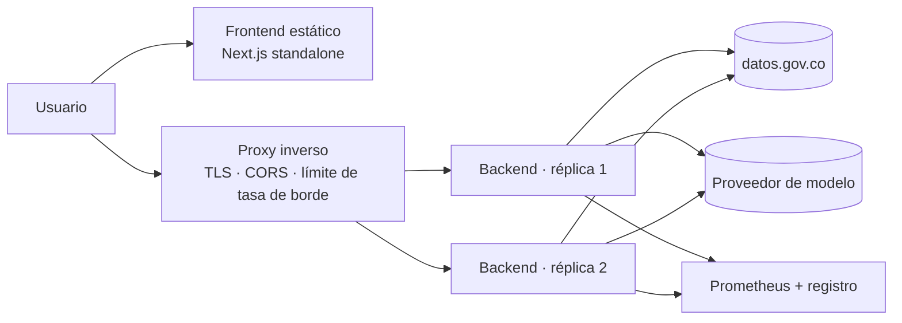

# SPEC-NT-03 · Operación, costos, SLO y proceso de equipo

| | |
|---|---|
| **Estado** | Propuesta |
| **Prioridad** | 🟠 Media |
| **Cierra** | TR-A2, TR-A3, TR-M4, TR-M7 |
| **Depende de** | SPEC-BE-05 (sin métricas no hay SLO verificable) |
| **Esfuerzo** | 3–5 jornadas |
| **Audiencia** | Propietario, quien opere el servicio, el equipo |

---

## 1. Problema

El sistema funciona en la máquina de quien lo escribió y no hay nada más. Cinco huecos, del
más urgente al menos:

### 1.1 El repositorio no está versionado (TR-A2)

`ESTADO.md` lo deja pendiente. **Sin git no hay historial, ni revisión, ni CI, ni forma de
revertir** ninguna de las refactorizaciones que estas especificaciones proponen. Es el
prerrequisito de todo el plan y cuesta cinco minutos.

Hoy, el único mecanismo de continuidad entre sesiones es un documento de estado que se
sobrescribe. Es una solución ingeniosa a un problema que no debería existir.

### 1.2 Sin integración continua (TR-A3)

Las 152 pruebas solo se ejecutan si alguien se acuerda. Las reglas de arquitectura que
introduce `SPEC-BE-01` **no valen nada sin un verificador automático**: una regla de ArchUnit
que nadie ejecuta es un comentario.

### 1.3 Nadie sabe cuánto cuesta esto

No hay medición de tokens ni de gasto. El proyecto usa la capa gratuita de Gemini, así que el
coste actual es cero y esa es precisamente la trampa: **la decisión de escalar se tomará sin
datos**. La pregunta «¿cuánto costaría con cien usuarios?» hoy no tiene respuesta ni
aproximada.

### 1.4 No hay definición de servicio

Ningún objetivo declarado de disponibilidad, latencia o tasa de error. Sin eso, `SPEC-BE-02`
calibra sus timeouts y umbrales contra la intuición: no hay criterio para decir si 120 s de
plazo es generoso o tacaño.

### 1.5 Sin despliegue ni pruebas de extremo a extremo (TR-M4, TR-M7)

Hay `Dockerfile`s generados por Quarkus y nada más: ni imagen del frontend, ni composición,
ni manifiestos. La restricción documentada —«no hay Docker en este entorno»— explica el
presente y no exime de definir el objetivo.

`verificar_en_vivo.py` es un verificador manual contra APIs reales: valioso, y no
automatizable en CI porque consume cuota y depende de la red.

---

## 2. Decisión

1. **Versionar hoy.** Antes de cualquier otra cosa de este plan.
2. **CI desde el primer día**, aunque solo ejecute lo que ya existe.
3. **Medir el gasto antes de necesitar controlarlo.**
4. **SLO modestos y honestos**, calibrados con datos y no con aspiraciones.
5. **Definir el despliegue objetivo** aunque no se pueda ejecutar en este entorno.

---

## 3. Diseño

### 3.1 Versionado (una hora, hoy)

```bash
git init
git add -A          # el .gitignore ya cubre .env, target/, .next/, node_modules/
git status          # VERIFICAR que .env no aparece — es el paso que no se puede saltar
git commit -m "chore: estado inicial verificado (88/88 backend, 64/64 frontend)"
git tag v0.2.0-legacy
```

Después: rama `main` protegida, trabajo por ramas, e issues para los pendientes de
`ESTADO.md`. Los módulos `backend/` y `frontend/` quedan capturados en la etiqueta y se
eliminan del tronco (`TR-B6`) — recuperables, fuera de la vista.

**Verificación obligatoria antes del primer commit:** `git status` no debe listar `.env`, ni
`target/`, ni `node_modules/`, ni `.next/`. Añadir `gitleaks` al CI en el mismo paso.

### 3.2 Integración continua

```yaml
name: verificar
on: [push, pull_request]

jobs:
  backend:
    steps:
      - uses: actions/setup-java@v4
        with: { java-version: '25', distribution: 'graalvm' }
      - run: ./mvnw -B verify              # incluye ArchUnit
  frontend:
    steps:
      - uses: actions/setup-node@v4
        with: { node-version: '24', cache: npm }
      - run: npm ci
      - run: npx tsc --noEmit
      - run: npx eslint .
      - run: npx vitest run --coverage
      - run: npm run api:verificar         # contrato sincronizado (SPEC-DOC-01)
  seguridad:
    steps:
      - uses: gitleaks/gitleaks-action@v2
```

**Sin claves de API en CI.** El perfil `test` las fuerza vacías y `TestIsolationGuardTest`
(`SPEC-BE-05`) lo verifica. Un CI que puede llamar a un modelo es un CI que puede gastar
dinero en un bucle.

Se añade después: `axe` sobre las cinco rutas (`SPEC-FE-03`) y validación de diagramas
(`SPEC-DOC-02`).

### 3.3 Presupuesto y control de gasto

**Medir primero.** Con las métricas de `SPEC-BE-05`:

| Métrica | Pregunta que responde |
|---|---|
| `llm_tokens_total` por proveedor y modelo | Cuánto consumimos |
| Tokens por caso de uso | Qué operación es cara |
| Peticiones por clave de API | Quién consume |
| Coste estimado = tokens × tarifa | Cuánto costaría escalar |

**Órdenes de magnitud** para dimensionar, con las tarifas de referencia a agosto de 2026
—hay que recalcularlas, cambian—:

| Operación | Entrada aprox. | Salida aprox. |
|---|---|---|
| Analizar un pliego de 60 páginas | ~40 000 tokens | ~4 000 |
| Generar propuesta | ~8 000 | ~8 000 |
| Validar con requisitos | ~12 000 | ~4 000 |
| Validar sin requisitos | ~52 000 | ~8 000 |
| Priorizar 40 procesos | ~6 000 | ~2 000 |

La fila que importa: **validar sin requisitos previos cuesta unas cuatro veces más que
validar después de analizar**. Es la justificación económica de la recomendación de producto
de `SPEC-NT-01` §3.5, y hoy no está cuantificada en ninguna parte.

**Controles**, por capas:

1. Cotas de entrada (`SPEC-BE-06` §3.4) — techo por petición.
2. Límite de tasa por clave (`SPEC-BE-06` §3.2) — techo por usuario y hora.
3. Alerta al 70 % del presupuesto mensual, corte al 100 % con mensaje explicativo.
4. Límites de gasto en la consola de cada proveedor: la última red, fuera de nuestro código.

### 3.4 Objetivos de servicio

Modestos a propósito. Un SLO que no se puede cumplir es peor que ninguno.

| Indicador | Objetivo | Ventana | Fuente |
|---|---|---|---|
| Disponibilidad de la API | 99 % | 30 días | `/q/health/ready` |
| Búsqueda p95 | < 3 s | 7 días | `procurement_request_seconds` |
| Análisis p95 | < 90 s | 7 días | `llm_request_seconds{use_case="analysis"}` |
| Análisis p99 | < 180 s | 7 días | Ídem |
| Errores 5xx | < 1 % | 7 días | Métricas HTTP |
| Fallos del proveedor | < 5 % | 7 días | `llm_request{outcome!="success"}` |

Dos aclaraciones que evitan discusiones:

- **La disponibilidad del proveedor de IA no cuenta contra el SLO del servicio.** Está fuera
  de nuestro control. Lo que sí cuenta es **degradar bien**: con todos los proveedores
  caídos, la búsqueda debe seguir funcionando. Ese es el objetivo real del mamparo de
  `SPEC-BE-02`, y es medible.
- **El 99 % es lo que sostiene un servicio sin guardia.** Prometer 99,9 % sin nadie de
  guardia es prometer algo que depende de que el incidente ocurra en horario laboral.

### 3.5 Alertas

Una alerta por cada procedimiento del runbook (`SPEC-DOC-01` §3.5). Sin procedimiento, no
hay alerta: una alerta sin acción asociada entrena a ignorarlas.

| Alerta | Umbral | Urgencia |
|---|---|---|
| Servicio no disponible | `ready` en DOWN > 5 min | Alta |
| Todos los proveedores con circuito abierto | > 5 min | Alta |
| Tasa de error 5xx | > 5 % en 15 min | Alta |
| Gasto al 70 % del presupuesto | — | Media |
| Un proveedor con circuito abierto | > 15 min | Media |
| SECOP no disponible | > 30 min | Baja |
| Mamparo rechazando peticiones | > 1 % en 1 h | Baja |

### 3.6 Despliegue objetivo

Aunque no se pueda ejecutar aquí, definirlo evita improvisar bajo presión:



Decisiones que conviene tomar ahora:

- **El backend no tiene estado**, así que escala horizontalmente sin más. Esa propiedad la
  garantiza `SPEC-NT-02` §3.5 (el servidor no almacena contenido) y hay que protegerla.
- **Dos réplicas mínimo**: con una, cualquier despliegue es una caída.
- **Imagen JVM, no nativa, al principio.** El arranque nativo es atractivo, pero la
  compilación nativa complica el CI y el tiempo de arranque no es un problema en un servicio
  de larga vida. Se reconsidera si se despliega en algo con escalado a cero.
- **Las claves, del gestor de secretos del orquestador.** Nunca en la imagen.
- **`/q/metrics` y `/q/health` restringidos a la red interna.**

Falta crear el `Dockerfile` del frontend; el backend ya los tiene generados por Quarkus.

### 3.7 Pruebas de extremo a extremo

Tres niveles, con criterios distintos:

| Nivel | Qué | Dónde | Cuándo |
|---|---|---|---|
| Unitarias e integración | 152 actuales + las nuevas | CI, sin red | Cada push |
| E2E con dobles | Playwright contra backend real con WireMock simulando SECOP y el proveedor | CI | Cada push |
| Verificación en vivo | `verificar_en_vivo.py` contra APIs reales | Manual | Antes de publicar |

El nivel intermedio es el que falta y el que más rinde: cubre el recorrido completo
—buscar → analizar → proponer → validar— sin consumir cuota ni depender de la red.
`verificar_en_vivo.py` se conserva como está, con su papel de comprobación previa a
publicar, que es exactamente para lo que sirve.

### 3.8 Proceso de equipo

**Definición de terminado**, para cualquier cambio:

- [ ] Pruebas que cubren el comportamiento nuevo, incluidos los caminos de fallo.
- [ ] CI en verde, ArchUnit incluido.
- [ ] Si cambia el contrato: OpenAPI regenerado y tipos del frontend sincronizados.
- [ ] Si cambia un flujo: diagrama de secuencia actualizado.
- [ ] Si es una decisión de arquitectura: ADR escrito.
- [ ] Si toca la interfaz: verificado con teclado y sin infracciones de `axe`.
- [ ] Si envía datos nuevos a un tercero: revisado contra `SPEC-NT-02`.

La última casilla es la que ninguna plantilla genérica trae y esta herramienta necesita:
cualquier funcionalidad puede acabar mandando material de un pliego a una empresa
estadounidense, y esa decisión no debería colarse dentro de un cambio rutinario.

**Revisión:** ninguna rama entra a `main` sin ella. Con un solo desarrollador, `/code-review`
sobre el diff antes de fusionar es el sustituto razonable.

**Versionado semántico** desde el `pom.xml` como fuente única (`SPEC-BE-01` §3.8), con
`CHANGELOG.md` — necesario porque `SPEC-BE-03` §4 y `SPEC-BE-06` cambian nombres de variables
de entorno y comportamiento observable.

---

## 4. Plan de ejecución

| Paso | Contenido | Cuándo |
|---|---|---|
| 1 | `git init`, verificar `.env`, etiqueta, eliminar módulos obsoletos. | **Hoy** |
| 2 | CI con lo que ya existe. | Fase 0 |
| 3 | `gitleaks`. | Fase 0 |
| 4 | Definición de terminado y plantilla de PR. | Fase 0 |
| 5 | Medición de tokens y coste estimado. | Con `SPEC-BE-05` |
| 6 | SLO declarados y paneles. | Tras 30 días de métricas |
| 7 | Alertas, una por procedimiento del runbook. | Con el runbook |
| 8 | E2E con Playwright y dobles. | Fase 4 |
| 9 | `Dockerfile` del frontend + composición. | Cuando haya destino de despliegue |
| 10 | `CHANGELOG.md`. | Antes de la fase 3 |

El paso 6 va **después** de treinta días de métricas a propósito: fijar objetivos sin datos
produce números inventados que luego nadie respeta.

---

## 5. Criterios de aceptación

1. El repositorio está en git; `.env` no aparece en ningún commit del historial.
2. CI ejecuta las 152 pruebas, el verificador de tipos, ESLint, ArchUnit y `gitleaks` en cada
   push, y bloquea la fusión si falla.
3. CI no dispone de ninguna credencial de proveedor de IA.
4. Existe un panel con tokens y coste estimado por proveedor, modelo y caso de uso.
5. Los SLO están declarados con sus fuentes de medición y llevan al menos 30 días medidos
   antes de fijarse.
6. Cada alerta tiene un procedimiento en el runbook; no hay alertas huérfanas.
7. Con el proveedor de IA caído, la búsqueda sigue funcionando — verificado en la suite E2E,
   no solo afirmado.
8. La suite E2E recorre los cuatro pasos del flujo sin consumir cuota.
9. La definición de terminado está en la plantilla de PR e incluye la casilla de datos a
   terceros.
10. Existe `CHANGELOG.md` con los cambios que rompen compatibilidad.

---

## 6. Riesgos

| Riesgo | Mitigación |
|---|---|
| `git init` con un secreto en el primer commit. | Verificación explícita en el paso 1 y `gitleaks` en el mismo paso. Si ocurriera: rotar la clave, no reescribir el historial. |
| CI lento desalienta su uso. | Backend y frontend en paralelo; E2E solo en PR. Objetivo: menos de 10 minutos. |
| SLO fijados sin datos y luego ignorados. | El paso 6 exige 30 días de medición previa. |
| El presupuesto de tokens se define y nadie lo vigila. | Alerta al 70 % y corte al 100 %, más el límite en la consola del proveedor como última red. |
| Playwright resulta frágil y se desactiva. | Cubre solo el recorrido principal, con dobles deterministas. Una suite pequeña y estable vale más que una amplia e intermitente. |

---

## 7. Fuera de alcance

- Elegir proveedor de nube o plataforma de orquestación: depende de decisiones de negocio
  que no están tomadas.
- Guardia 24×7 y gestión formal de incidentes: desproporcionado para el tamaño actual, y es
  la razón por la que el SLO es 99 % y no más.
- Pruebas de carga: sin usuarios reales, los números serían ficción. Se harán cuando haya
  tráfico que extrapolar.
- Recuperación ante desastres: no hay estado que recuperar, por diseño.
